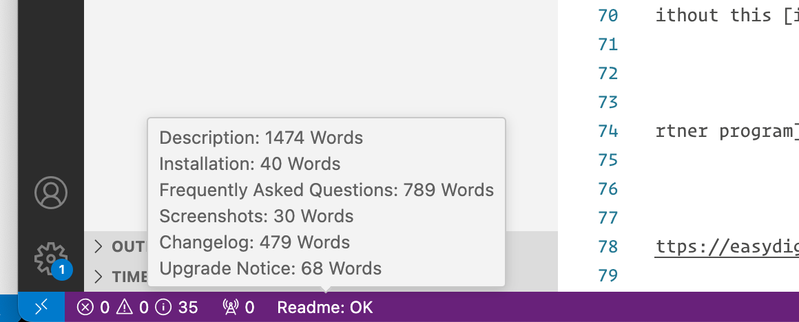
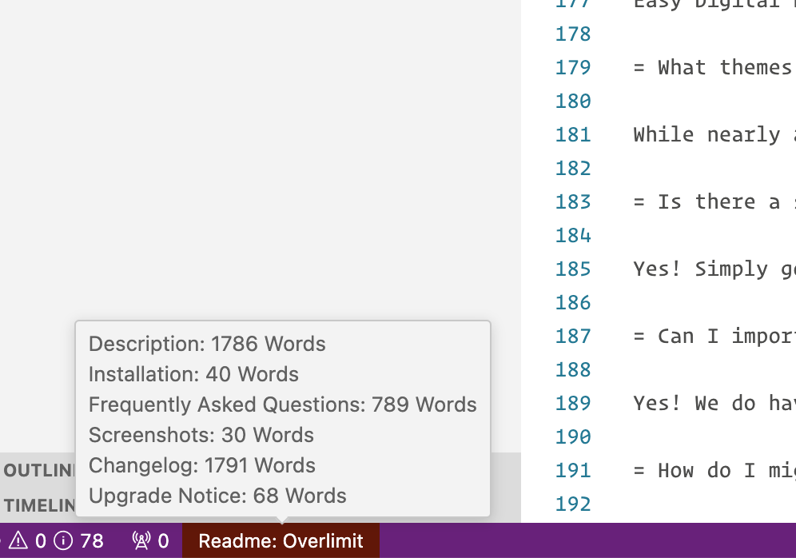

# Readme Word Count README

This adds a status bar item when editing files named 'readme.txt' that are either labeled as markdown or plaintext. It breaks down the word count for each section, to ensure that it is within the 1500 word limit. It also will give you the word count of the selected text.

## Features

### WordCounts by Section

Each section is broken down in the tooltip to tell you the length of each section.

When one of your sections is over the 1500 word limit, you are warned by the status bar item color.

### Selection Count

This extension support to count selection text.

When selecting content, you will see how many words you have currently selected, helping you when trying to trim down your content.

## Feedback and Support

Welcome open issue to the GitHub repo, if there are any feedback (problems with usage, find a bug, feature request, language support and so on).

## Release Notes

### 0.0.1
Initial Release
